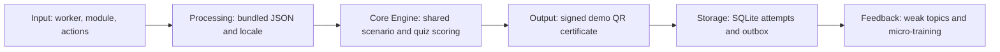

# ForgeIndia — SIH26041 submission copy

Audit: 30 September 2026. One-time deck brief only. Official portal confirms Software / Smart Education. Copy follows the supplied six-slide structure; exact official 2026 template file and mandatory pointer wording remain [VERIFY].

Counts include titles/pointer labels; exclude citation IDs/URLs, notes and diagram. Whitespace tokens containing letters/numbers count; standalone symbols do not. Cover/reference titles retain exact names rather than the 6–12-word content-bullet rule.

## Slide 1 — Title

**29 words**

PS ID: SIH26041  
PS title: AR-Based Vocational Training Simulator for Industrial Safety in Jharkhand's Mining & Manufacturing Sector  
Theme: Smart Education  
Category: Software  
Team name: ForgeIndia  
Idea title: SurakshaXR

Speaker notes (not slide text):
1. ForgeIndia presents SurakshaXR for the Government of Jharkhand's SIH26041 challenge.
2. This is a working offline prototype, with AR and language limitations disclosed.

## Slide 2 — Proposed Solution

**64/110 words**

- Gap: Jharkhand needs rehearsal beyond manuals and disruptive live drills. [R1]

**(a) what we built**

- Solution: SurakshaXR combines automatic AR layouts with offline 3D training.

**(b) how it solves the PS**

- Fire & Explosion Response: practise alarms, equipment decisions, evacuation.
- Gas Leak & Confined Space Protocol: practise PPE and buddy procedures.

**(c) innovation and uniqueness**

- Shared scoring links quizzes, signed demo QR certificates, targeted refreshers.

Source footer: [R1](https://www.sih.gov.in/sih2026PS)

Speaker notes:
1. Both named modules completed simulator practice and assessment in airplane mode on the emulator.
2. Differentiation is the connected workflow; we claim neither market-first novelty nor proven learning gains.

## Slide 3 — Technical Approach

**73/90 words, plus 31 diagram words**

**tech stack**

- Unity 6.3/C# runs SurakshaXR’s joystick simulations and assessment workflow.
- SQLite persists Fire/Gas attempts; Ed25519 signs locally generated QR certificates. [R4, R5]
- AR Foundation/ARCore adapter is partial; physical placement remains unverified. [R2, R3]

**implementation methodology**

- Method: Fire/Gas JSON, shared scoring, automated tests, airplane-mode emulator checks.

**Roadmap**

- FastAPI sync and React/TypeScript compliance views extend the existing scaffold.
- Reviewed Santali translations replace the bundled English review placeholders.
- Validate Fire/Gas SOPs against current DGMS/OSH requirements before deployment. [R6, R7]

Source footer: [R2](https://developers.google.com/ar/develop/unity-arf/enable-arcore), [R3](https://docs.unity3d.com/Packages/com.unity.xr.arfoundation@6.3/manual/index.html), [R4](https://sqlite.org/atomiccommit.html), [R5](https://www.rfc-editor.org/info/rfc8032/), [R6](https://www.dgms.gov.in/writereaddata/UploadFile/MineVocational966.pdf), [R7](https://www.pib.gov.in/PressReleasePage.aspx?PRID=2209767&lang=1&reg=6)

Speaker notes:
1. The diagram shows the local worker path; AR and 3D submit actions to the same scoring service.
2. FastAPI and React currently provide a health scaffold; synchronization, compliance views and Santali translation remain Roadmap.

## Slide 4 — Feasibility & Viability

**72/90 words**

**feasibility (technical, operational, financial, adoption)**

- Technical: 44.87 MB ARM64 APK targets Android 10+.
- Verification: 60 Unity tests passed; airplane-mode emulator flows completed.
- Operational: Fire/Gas training needs no login, headset, or connectivity.
- Financial: bundled models avoid asset downloads; deployment costs remain [VERIFY].
- Adoption: Hindi drafts support practice; native safety review remains pending.

**risks, mitigation**

- AR incompatibility → optional provider and a selectable 3D fallback. [R2]
- Unapproved SOPs → demo labels and configurable scenario rules.

Source footer: [R2](https://developers.google.com/ar/develop/unity-arf/enable-arcore)

Speaker notes:
1. The 44.87 MB figure is APK size, not installed size, RAM use or a low-end-device benchmark.
2. DGMS material is a review reference; demo scores and certificates do not establish legal competence or compliance.

## Slide 5 — Impact & Benefits

**46/80 words**

**Potential benefits; not measured outcomes**

- Worker / social: rehearse Gas PPE choices using Hindi draft instructions.
- Employer / economic: repeat Fire drills without consuming physical extinguisher supplies.
- State/regulator: inspect signed demo certificates; no statutory certification claim.
- Environmental: virtual Fire/Gas practice requires no physical smoke or gas.

Speaker notes:
1. These are capabilities and potential benefits of the Fire/Gas workflow, not measured pilot outcomes.
2. No repository evidence establishes accident reduction, retention improvement, employer savings or environmental savings.

## Slide 6 — Research & References

**46 title words; URLs excluded**

- [R1: Smart India Hackathon 2026: SIH26041 Problem Statement](https://www.sih.gov.in/sih2026PS)
- [R2: Enable AR in your AR Foundation app (Android only)](https://developers.google.com/ar/develop/unity-arf/enable-arcore)
- [R3: AR Foundation 6.3 manual](https://docs.unity3d.com/Packages/com.unity.xr.arfoundation@6.3/manual/index.html)
- [R4: Atomic Commit In SQLite](https://sqlite.org/atomiccommit.html)
- [R5: RFC 8032: Edwards-Curve Digital Signature Algorithm (EdDSA)](https://www.rfc-editor.org/info/rfc8032/)
- [R6: Mines Vocational Training Rules, 1966](https://www.dgms.gov.in/writereaddata/UploadFile/MineVocational966.pdf)
- [R7: Year End Review 2025 – Ministry of Labour & Employment](https://www.pib.gov.in/PressReleasePage.aspx?PRID=2209767&lang=1&reg=6)

Speaker notes:
1. Sources support problem fit, implementation choices and the safety-review framework.
2. They do not certify this prototype; current site rules and authorized content review remain necessary.

## Slide 3 diagram and exact labels

1. Input: worker, module, actions
2. Processing: bundled JSON and locale
3. Core Engine: shared scenario and quiz scoring
4. Output: signed demo QR certificate
5. Storage: SQLite attempts and outbox
6. Feedback: weak topics and micro-training

The diagram represents the local worker flow, not backend analytics or verified physical AR tracking.

## Claim → evidence

Paths are relative to this repository root. See SIH2026_FEATURE_AUDIT.md for the internal BUILT/PARTIAL/PLANNED table.

| Claim | Status | Repository / reference | Limit |
|---|---|---|---|
| Fire alarm, equipment and evacuation decisions | BUILT | mobile-unity/Assets/StreamingAssets/Content/scenarios/fire_v1.json; demo/runtime-policies/fire.json | Demo decisions, not certified extinguisher technique |
| Gas PPE, buddy and safe-route decisions | BUILT | mobile-unity/Assets/StreamingAssets/Content/scenarios/gas_v1.json; demo/runtime-policies/gas.json | Configured demo PPE, not approved site advice |
| Shared scoring, quiz and weak topics | BUILT | mobile-unity/Assets/SurakshaXR/Application/TrainingSessionService.cs; Domain/ScenarioRuntime.cs; Domain/Assessment.cs | One authoritative engine |
| Local persistence and outbox | BUILT | mobile-unity/Assets/SurakshaXR/Infrastructure/LocalStore.cs; R4 | Queued events do not prove network sync |
| Signed demo QR certificates | BUILT | mobile-unity/Assets/SurakshaXR/Security/CertificateCodec.cs; Tests/EditMode/CertificateTests.cs; backend/app/domain/certificates.py; R5 | No statutory recognition |
| Targeted micro-training | BUILT | mobile-unity/Assets/SurakshaXR/Application/RefresherPlan.cs; Tests/EditMode/TrainingSessionTests.cs | Gas Hindi device flow; both-module service tests |
| 44.87 MB, ARM64, Android10+ target | BUILT | artifacts/android/handover-verification.json; SurakshaXR-preview-badging.txt | 44,870,802bytes; not low-end performance proof |
| 60 Unity tests | BUILT | artifacts/unity/editmode-results.xml | Engineering tests, not learning accuracy |
| Airplane-mode Fire/Gas flows | BUILT | demo/evidence/android/offline-database-report.json; STATUS.md | Five test attempts, two verified certificates; no real-user count |
| Optional AR adapter | PARTIAL | mobile-unity/Assets/SurakshaXR/Presentation/OptionalArSession.cs; Editor/OptionalArConfiguration.cs; Packages/manifest.json; R2/R3 | User photo proves camera overlay; automatic grounded layout and anchoring implemented; outdoor physical validation pending |
| Hindi draft | PARTIAL | demo/localization/hi.json; hi-draft.json; hindi-gas-assessment-result.png | 275 draft keys; native/domain review pending |
| Santali translation | PLANNED | demo/localization/sat.json; translation-review.csv | 275 English review placeholders; Roadmap only |
| Authenticated sync/compliance views | PLANNED | backend/app/main.py; admin-web/src/App.tsx; docs07/09 | Existing health scaffold only; Roadmap features |
| Problem gap, category, theme | EXTERNAL | R1 | Official SIH26041 page; background statistics excluded |
| Regulatory alignment | PLANNED | docs/22_CONTENT_AUTHORING_AND_REVIEW.md; modules.json contentValidation; R6/R7 | Demo-unvalidated; review under Roadmap |
| Potential stakeholder/environmental benefits | INFERENCE | TrainingGeometry.cs; TrainingSessionService.cs; Hindi draft | Virtual drills consume no physical extinguisher supplies or fire/gas; no measured savings |

## Reference metadata (outside slide)

All seven source pages opened on30September2026.

| ID | Publisher | Year |
|---|---|---|
| R1 | Smart India Hackathon | 2026 |
| R2 | Google for Developers | 2026; updated4September |
| R3 | Unity Technologies | Accessed2026; publication year not stated [VERIFY] |
| R4 | SQLite | 2026; updated21April |
| R5 | RFC Editor / IRTF | 2017 |
| R6 | Government of India; hosted by DGMS | 1966 instrument |
| R7 | Ministry of Labour & Employment / PIB | 2025;30December |

R6 is a historical training reference, not proof every provision applies unchanged in2026. R7 reports Labour Codes effective21November2025. Do not make a blanket Mines Act1952 compliance claim. Current DGMS/OSH/site requirements need qualified review.

## All [VERIFY] items

- Official2026 template file, exact pointer wording, possible team-ID field and final upload format. ForgeIndia is user-confirmed; Software and Smart Education were portal-verified.
- Full PS scope: official accessible description truncates after the start of Machinery despite mentioning five domains. Do not invent omitted modules.
- Physical phone model/Android version, outdoor AR anchors, tracking recovery, repeated sessions and offline operation. Camera-overlay photo alone is not tracking proof.
- Low-end FPS, RAM, battery, installed size and phone support. APK size is not a performance benchmark.
- Hindi native/safety approval and actual Santali translation/review.
- Applicable DGMS/OSH/site SOP mapping and authorized issuer provisioning before any compliance claim.
- Deployment/support costs, licensing eligibility, pilot arrangements and adoption. No outcome statistics are included.
- R3 publication year if required;2026 is access/copyright context only.

## Originality and scope

No existing deck prose was reused. Concrete modules/workflows come from the repository. No pilot, accuracy, accident-reduction or savings statistics are asserted. New outdoor AR work requested after this audit must remain qualified until built/tested. The original prompt governs only this submission text, not future development instructions.
