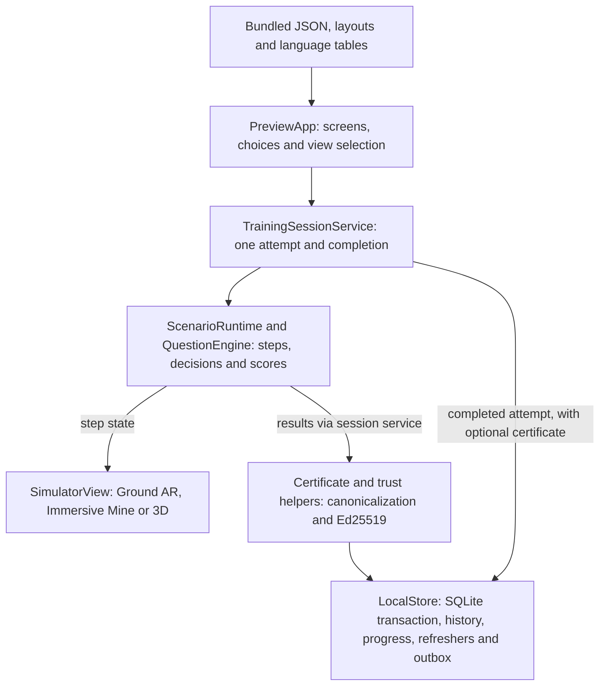
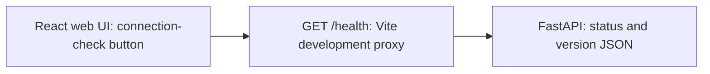
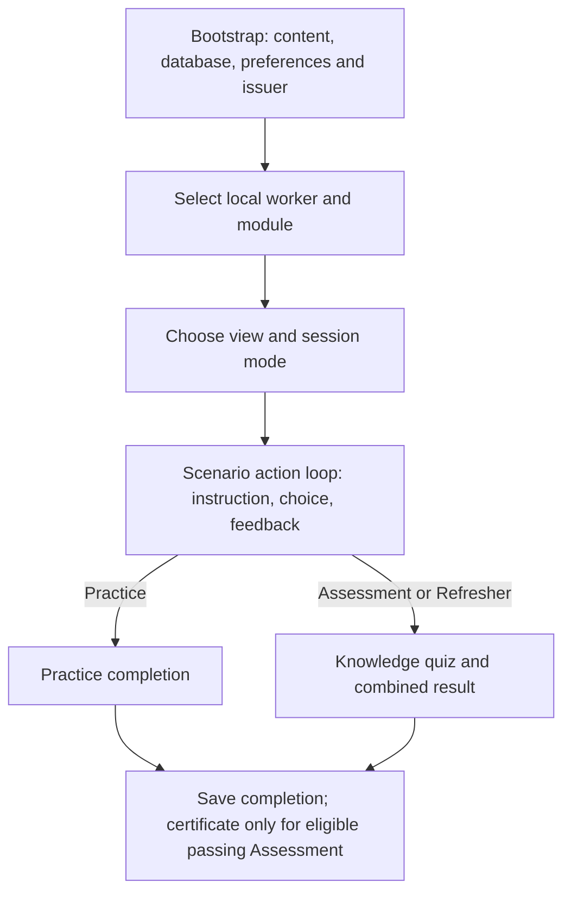
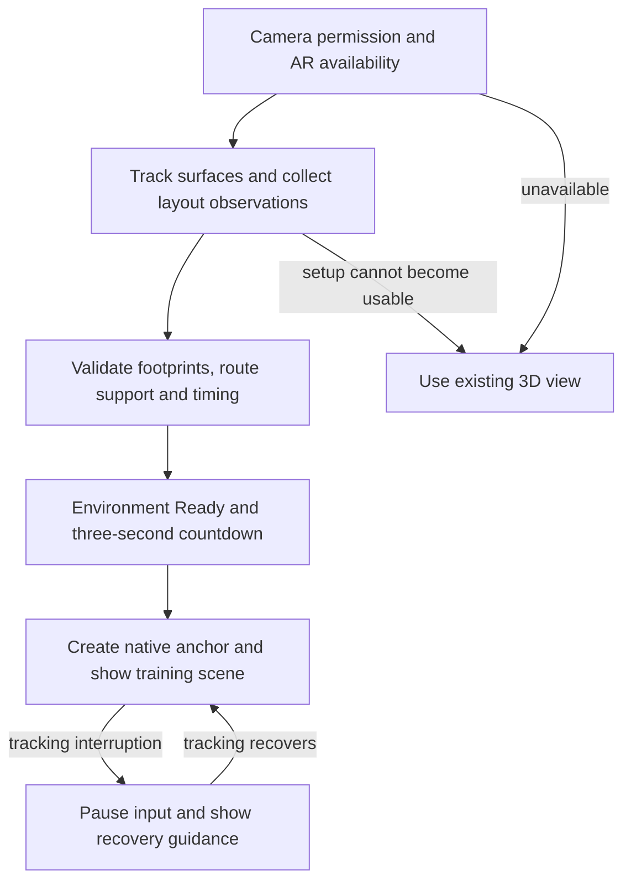

# SurakshaXR Internal Architecture and Workflow

How the Android training app is assembled and how information moves through it

ForgeIndia | SIH26041 | Personal technical guide | 3 October 2026

## The main idea

SurakshaXR is a Unity Android application that teaches two scenario-based modules: Fire and Explosion Response, and Gas Leak and Confined Space Protocol. A worker chooses a module, follows a sequence of decisions, receives feedback and can take an assessment. The same training content can appear over the camera in Ground AR, inside a virtual mine driven by the phone's tracked movement, or in a joystick-controlled 3D simulator.

The most useful way to understand the app is to separate three things. **Content** describes the scenario and its rules. **The training engine** decides what an action means and which step follows. **Presentation** draws the scene, shows instructions and plays effects. An extinguisher model does not award marks; an accepted action in the engine does.

Most worker-side information stays on the phone. Bundled JSON files provide content, local string tables provide language, SQLite stores records, and local cryptography signs and verifies certificate QR payloads. The worker flow does not call a server to decide an answer or calculate a score.

## Read the guide in this order

| Part | What it explains |
| --- | --- |
| Technology and architecture | The libraries, layers and responsibilities |
| Startup and training | What happens after each worker interaction |
| AR and scene construction | How objects receive positions and remain anchored |
| Storage and certificates | How results become durable, verifiable records |
| UI and supporting web code | Language, Android bridges, dashboard and build flow |

## One concrete example

When a worker selects the configured extinguisher action, the UI sends its stable action ID to ScenarioRuntime. The runtime records the action, changes its score and step, and returns the result. TrainingActionEffects then animates the extinguisher and fire. TrainingSessionService eventually packages the completed session for LocalStore. This ownership chain is the basis of the whole application.

The file references at the end let you move from each explanation to the exact implementation. [S01-S06]

<!-- page -->

# The mobile technology stack

Unity runs the Android application, manages the scene and renders its UI. Most app logic is written in C#. Small Java bridges give that code access to Android facilities such as SQLite, Keystore and notifications. These are the project's pinned package versions, rather than a list of newer alternatives.

| Technology | Version or configuration | Role in this app |
| --- | --- | --- |
| Unity and C# | Unity 6000.3.24f1 | App lifecycle, scene objects and application logic |
| Android player | IL2CPP; ARMv7 and ARM64 | Converts managed code into native Android libraries |
| Android platform | Minimum API 29; target API 35 | Android 10 minimum and platform build target |
| Graphics | OpenGL ES 3; built-in rendering | Standard materials and custom scene shaders |
| UI Toolkit and TextCore | Bundled with Unity | Runtime screens, touch controls and text shaping |
| AR Foundation | 6.3.5 | Unity-facing AR session, plane, raycast and anchor APIs |
| ARCore XR Plugin | 6.3.5 | Android provider for native tracking and AR data |
| XR Plug-in Management | 4.6.1 | Starts and stops the AR provider |
| XR Core Utilities | 2.6.0 | XROrigin and tracked camera coordinate setup |
| Unity Localization | 1.5.13 | Bundled StringTables selected by locale |
| Newtonsoft JSON package | 3.2.2 | Content parsing, record serialization and JSON validation |
| SQLite | Android system implementation | Local relational data through a Java/JNI bridge |
| BouncyCastle.Cryptography | 2.7.0 | Ed25519 signing and signature verification |
| ZXing.Net | 0.16.11 | QR generation and camera-image decoding |

There is no separately pinned SQLite engine in the APK. Android supplies SQLiteDatabase; desktop storage code uses a native SQLite interface. JNI is the bridge between Unity C# and the Android Java classes.

The graphics pipeline uses authored meshes, Standard materials and custom fire, smoke, guidance and rock shaders. It does not use a Universal Render Pipeline package or download 3D content while training. [S01, S07, S08]

<!-- page -->

# Supporting tools and project assets

The repository also contains Python backend code and a React web application. They are separate processes from the Android app. Their dependency files belong to their own folders; they are not automatically packaged into the phone APK.

| Technology | Pinned version | Purpose |
| --- | --- | --- |
| Python | Root pin 3.13.9; requires 3.13+ | Backend and repository verification scripts |
| FastAPI | 0.141.1 | HTTP application and generated API documentation |
| Uvicorn | 0.54.0 | Runs the Python ASGI application |
| Pydantic | 2.13.5 | Typed response validation |
| cryptography | 50.0.1 | Python-side Ed25519 and certificate helper functions |
| jsonschema | 4.26.0 | Validates JSON content against repository schemas |
| React and React DOM | 19.3.0 | Browser UI and component rendering |
| TypeScript | 7.0.2 | Types and compiler checks for web code |
| Vite | 8.3.1 | Web development server, proxy and production bundle |
| Node.js | 24.x; root pin 24.11.1 | Web tooling runtime |
| Unity Test Framework | 1.6.0 | C# EditMode verification |
| pytest and HTTPX | 9.1.1 and 0.28.1 | Python checks and HTTP test client |
| Vitest and Testing Library React | 5.0.2 and 16.3.3 | Web component and interaction checks |
| PowerShell and GitHub Actions YAML | Repository scripts and workflow | Local build orchestration and CI definitions |

## Fonts and graphics

Bundled Noto Sans, Devanagari and Ol Chiki fonts render text. Material icons retain Apache 2.0 attribution. TrainingGeometry creates equipment and mine meshes; shaders control their appearance. Geometry, icons and fonts are local resources.

Dependency locks contain the full inventory: Unity packages-lock.json, Python requirements files and the web package-lock.json. [S01, S07, S10, S12]

<!-- page -->

# How the architecture fits together

The Android application has a presentation layer, an application-service layer, a domain layer, infrastructure and security helpers. The diagram shows responsibility and information flow; it is not a map of separate Android processes.

<!-- diagram:architecture -->


## Why these boundaries matter

PreviewApp coordinates screens and calls the session service. TrainingSessionService owns the complete attempt, including the knowledge quiz and save operation. ScenarioRuntime owns the active scenario step and scoring changes. SimulatorView consumes the selected step's visual commands and places the corresponding objects.

LocalStore performs database work through ISqliteConnection. Security code creates canonical certificate bytes, signs them and verifies QR envelopes. These components can be used without an AR camera; changing the renderer does not require a second scoring implementation.

The React and FastAPI code sit outside this Android boundary. The web UI calls a health endpoint. Local outbox records are not an active network connection to that endpoint. [S02-S08, S10]

<!-- diagram:web -->


<!-- page -->

# What happens when the app opens

The Bootstrap scene loads, and a runtime initialization hook creates PreviewApp. Its Awake method creates the UI Toolkit document, opens local services and decides which screen to show. Navigation is primarily a screen state inside PreviewApp, rather than one Unity scene for every page.

<!-- diagram:worker -->


## Startup in more detail

PreviewContent first reads the bundled content manifest and checks SHA-256 hashes of its JSON resources. LocalStore opens surakshaxr.db in Android's app-private internal storage, applies its schema and seeds the demo workers if absent. Preferences restore the locale, active worker and sound setting. DemoIssuer prepares the local signing identity, and reminder scheduling reads pending refreshers. Choosing a local worker profile is not an online login.

The selected module supplies scenario, policy and question-bank IDs. Starting a session creates one TrainingSessionService and one ScenarioRuntime. The chosen view supplies visuals and movement controls; the service does not change when AR is replaced with 3D during the same attempt.

The active scenario lives in memory. Completed attempts are durable records in SQLite; this is not a disk checkpoint of every unfinished step. [S02, S03, S06]

<!-- page -->

# How scenarios and actions work

Training content is data. A module points to scenario and question-bank IDs. A scenario contains named entities, logical anchors, steps, allowed actions, score changes, feedback keys and visual commands. A separate runtime policy specifies the entry step and maps actions to score categories. ContentParser validates the definitions before use.

| File or resource | Information it supplies |
| --- | --- |
| modules.json | Module IDs, versions, pass policy and refresher policy |
| scenarios/fire_v1.json and gas_v1.json | Steps, actions, entities, feedback and visual commands |
| policies/fire.json and gas.json | Entry step and action-to-category mapping |
| questions/fire_v1.json and gas_v1.json | Question IDs, answer IDs and topic tags |
| ScenarioLayouts.json | Spatial relationships, footprints, routes and orientation |
| ActionPresentation.json | Action IDs mapped to alarm, discharge and arrival effects |

## The action loop

1. PreviewApp shows the current step's localized instructions and allowed choices.
2. A selected choice supplies its actionId to ScenarioRuntime.SubmitAction.
3. The runtime checks state, allowed action and monotonic UTC/action timing.
4. It appends an ActionRecord, changes the category score and applies the transition.
5. The UI shows feedback; SimulatorView and TrainingActionEffects update presentation.

A correct action advances to nextStepId, or completes the scenario if there is no next step. An incorrect action normally leaves the worker on the same step. Configured critical failures end assessment/refresher scenarios; practice permits corrective learning. The runtime exposes copies of content definitions so UI code cannot silently rewrite its rules.

Walking into a marker or a spray particle hitting an object does not submit a decision. The worker's explicit choice is authoritative. In 3D and Immersive Mine, proximity to the focused target can gate access to that choice.

## The two module sequences

Fire follows hazard recognition, raising the alarm, choosing the configured permitted response, and reaching the safe exit/muster point. Gas has five separate steps: detector-alarm recognition, respecting the restricted boundary, selecting PPE, confirming the buddy/attendant, and reporting while using the safe route. Both use the same runtime class. Specific responses come from content, not from model geometry. [S03, S04]

<!-- page -->

# How assessment and refreshers are calculated

Practice, assessment and refresher are modes of the same session system. Practice contains guided scenario decisions and stores completion. Assessment requires completed practice when requirePractice is enabled, then combines scenario performance with a knowledge quiz. SessionOptions currently requests five assessment questions.

QuestionEngine orders questions deterministically using the attempt identity, so the same identity produces the same selection. Answers use stable option IDs. Multiple-choice correctness compares the selected set with the expected set; the score is based on the proportion of correct answers.

## Scoring example

The bundled module policy assigns 80 percent to scenario score and 20 percent to quiz score, with a pass threshold of 70. For a scenario score of 85 and quiz score of 80, the final score is 84. A configured critical failure still forces failure. These numbers are editable demo content, not legal training standards.

Scenario category totals are bounded between zero and each configured maximum. Weak-topic tags come from incorrect scenario actions and quiz answers. TrainingSessionService combines and ranks these tags to describe what needs reinforcement.

| Mode | Questions and result | Certificate behavior |
| --- | --- | --- |
| Practice | Guided scenario; no knowledge quiz | Stores practice completion; no certificate |
| Assessment | Scenario followed by configured question count | Eligible passing result can create a signed certificate |
| Refresher | Topic-focused scenario and shorter configured quiz | Stores refresher result; no new certificate |

## Completion and refresher selection

Complete is allowed only after the scenario ends and all required quiz answers are supplied. The service freezes an attempt snapshot and constructs related certificate/refresher records before one database completion transaction. Retrying a save reuses that snapshot, including its IDs, times and signature.

RefresherPlan maps weak tags to selected micro-training steps; TrainingSessionService prioritizes related quiz questions. With no matching weak tags, the configured general selection applies. The module's bundled default interval is 90 days. Passing a refresher completes its pending record and can schedule the next one; the due date is local policy data. [S03-S06]

<!-- page -->

# How automatic Ground AR is placed

AR Foundation is the Unity-facing API. ARCore supplies the phone's native tracking and detected planes. OptionalArSession starts these services only after AR entry and camera permission; it creates ARSession, XROrigin, the tracked camera and the plane, raycast and anchor managers. AR services must already be installed: this entry path checks availability without downloading them.

<!-- diagram:ar -->


Ground AR does not classify trees, machinery or doors. It uses tracked horizontal plane hits to fit a predefined local layout. Candidate root headings and small offsets rotate/translate the whole arrangement. Ground hits can adjust height, while relative horizontal positions remain coherent.

Readiness uses actual tracking and a valid observed layout, with configured timing gates: at least 2.5 seconds of scanning, 0.7 seconds of tracking and two valid layout observations, followed by a three-second countdown. This is not a requirement to hold the phone motionless. Footprints, route points, slope and height variation are checked before acceptance.

The accepted layout is parented under one native AR anchor. After setup it does not chase the camera. Tracking loss pauses interaction and shows recovery guidance; the same attempt can continue in 3D. Depth occlusion is enabled only when supported; depth is not required for placement. [S08]

<!-- page -->

# How the scene is constructed and moved

ArGroundLayout transforms ScenarioLayouts.json from local coordinates into world positions. SimulatorView applies the same template to Ground AR, Immersive Mine and 3D. An entity's logical ID connects its scenario role to the object; its model pivot offset puts its base on the measured ground.

Normal scene scale is one Unity metre per authored metre. The template separates equipment stations, hazard regions and destination markers. Route clearance considers every equipment footprint and the arrow envelope. For example, the fire centre is 4.5 m ahead of the start and the gas entry is 4.7 m ahead. These are visualization choices, not safety clearances.

| View | Camera and movement | Placement basis |
| --- | --- | --- |
| Ground AR | Real camera; worker moves phone/body | Measured ground and a native anchor |
| Immersive Mine | Tracked phone pose inside a virtual mine; joystick can move the virtual scene | Tracked origin with an estimated eye-height offset |
| 3D simulator | Virtual first-person camera; touch look and joystick | Same layout relative to a virtual start |

## Geometry and effects

TrainingGeometry builds mesh and primitive groups for drums, tank, tripod, manhole, PPE, attendant, mine shell and signs. Repeated static pieces are combined by material. TrainingFire, SoftSmoke, Guidance and CaveRock shaders provide their appearance without remote assets.

TrainingActionEffects listens to accepted presentation actions. Alarm motion/audio and extinguisher pin, handle, hose and spray effects illustrate the response. CharacterController movement and colliders constrain virtual motion. MappedSurfaceCollider creates a collider from an AR plane boundary; it is not a complete reconstruction of real objects. Fire/gas effects are illustrative rather than fluid or combustion simulation.

TargetGuidance keeps its ground ring fixed and shrinks only the floating arrow as planar distance decreases. The arrow disappears near the target. Safe-zone signs can face the camera, while the actual ground objects keep their orientation. Gas cloud and simulated-wind hints are practice visuals, not real sensor readings. [S08, S09]

<!-- page -->

# How information is stored offline

LocalStore owns the SQLite schema and record operations. On Android, SqliteConnection delegates to LocalDatabase.java through JNI; that bridge uses Android SQLiteDatabase. Although PreviewApp supplies a Unity persistent path, the Android connection replaces it with Context.getFilesDir()/surakshaxr.db: app-private internal storage, separate from bundled read-only content.

| Table | What it holds |
| --- | --- |
| app_meta | Schema version and saved preferences |
| workers | Worker identity, display data and preferred language |
| attempts | Completed action/quiz history, scores, mode and content identity |
| certificates | Signed payload, signature and QR envelope tied to an attempt |
| module_progress | Practice completion, latest attempt and derived progress |
| refreshers | Due date, weak topics and completion link |
| outbox_events | Local event payloads, retry counts and acknowledgement metadata |
| trusted_signers | Signer trust information supported by storage |
| completion_receipts | Snapshot used to detect conflicting completion retries |

## One completion transaction

LocalStore.Complete checks ownership and content identity, inserts the attempt and any certificate, updates derived module progress, manages the refresher and queues outbox events inside one transaction. If a step fails, the transaction rolls back. An identical retry is accepted without creating a duplicate; a changed payload using the same attempt ID is rejected.

Database triggers reject updates and deletes on attempts and certificates. Progress and reminder projections can change, but past assessment evidence remains append-only. SQL parameters are bound rather than interpolating worker input into queries.

## What an outbox means here

The outbox is a local queue, not a server connection. It keeps events and retry/acknowledgement metadata beside the records. The present UI does not transmit those events over HTTP. Consequently, training and local history do not wait for the Python backend. Live certificate verification uses the verified TrustBundle passed to the service, rather than assuming a stored signer row is automatically trusted. [S06, S07]

<!-- page -->

# How QR certificates are created and checked

A certificate is signed data represented as a QR code. Its payload identifies the worker, module and version, attempt, score, issue time, refresher date and signer. The QR carries the payload and signature, so a verifier does not need to fetch a certificate page from a website.

```mermaid
flowchart TD
    subgraph Create
        A["Eligible passing Assessment"] --> B["Payload and canonical UTF-8 bytes"]
        B --> C["Ed25519 signature and envelope"]
        C --> D["Certificate record in completion transaction"]
        D --> E["Generate QR pixels from saved envelope for display"]
    end
    subgraph Verify
        F["Read QR image or envelope text"] --> G["Decode and validate canonical payload"]
        G --> H["Resolve signer in local trust bundle"]
        H --> I["Check signature and trust rules"]
        I --> J["Show verification result"]
    end
```

<!-- diagram:certificate -->


CertificateCanonicalizer creates predictable UTF-8 JSON bytes with constrained fields and values. CertificateCodec signs those bytes using Ed25519, then places base64url payload and signature strings in an envelope with an algorithm identifier. ZXing converts the envelope into pixels and decodes scanned QR images.

Verification checks envelope structure, supported version, canonical payload, signer identity, signature and the signer's validity/revocation information in the local trust bundle. An unknown signer is reported as unverified; a mathematically valid signature alone does not establish trust.

DemoIssuer loads the bundled issuer/trust material. On Android, IssuerVault uses an Android Keystore AES key to protect the locally stored signing seed. The bootstrap seed is included in the demo package, so this explains the software mechanism without treating that demo identity as a secure production authority. Offline verification reflects the trust bundle available on that device. [S05, S07]

<!-- page -->

# How the interface and Android services work

PreviewApp constructs screens with UI Toolkit VisualElements and applies AppTheme styles and AppIcons. Render rebuilds the current screen from application state. It also resets the joystick and old control references so a detached control cannot continue moving the player.

Menus use portrait orientation. AR setup and AR training request landscape orientation. Screen.safeArea supplies display insets for cutouts and gesture areas. AR starts with its action panel collapsed; a compact task hint and Show actions control keep the training view usable.

## Language selection

The selected locale chooses a bundled Unity StringTable. Content stores keys such as fire.module.title rather than hard-coding a translated sentence in the scenario engine. PreviewContent.Text resolves a key, and TextCore renders it with Noto Sans, Devanagari or Ol Chiki font resources. Changing language changes presentation, not action IDs or scoring.

The language pipeline uses authored strings, not an online translation service. English and Hindi contain localized text; the Santali table currently carries explicit review-marked fallback strings. A locale file and a font alone do not perform automatic translation.

## Touch and tracking lifecycle

MovementJoystick keeps the owning pointer ID, clamps movement and resets on release, cancellation, resize or detach. PreviewApp also cancels movement on redraw, app focus/pause changes and tracking interruption. SimulatorView reads the resulting movement vector; presentation effects can be suspended while tracking recovers.

## Camera and reminders

Camera permission is requested when entering AR or QR scanning. OfflineQrScanner reads local camera frames, decodes QR content and releases the camera when leaving. Notification permission is requested when reminders are enabled on Android versions that require it.

OfflineReminders chooses the next pending refresher and calls RefresherReminder.java. Android schedules a local notification; stored scheduling information can be reloaded after reboot. The reminder opens the application, whose local refresher list supplies the actual learning task. No remote push notification or cloud TTS is involved. [S02, S07, S11]

<!-- page -->

# How the web code and build process work

The React app and FastAPI service are separate from the worker app. App.tsx offers a connection-check button that calls getHealth and fetches /health, with a five-second timeout. It does not send that request at startup. During development Vite proxies it to Python at 127.0.0.1:8000. FastAPI returns typed JSON containing status and version; React renders the response or an error.

FastAPI also exposes generated API documentation. Its domain package contains Python certificate/canonicalization helpers. Those helpers are local functions, not HTTP certificate endpoints. The actual backend code has no server database, ORM or worker-record API, so PostgreSQL does not belong in the description of the app's current runtime stack.

## From source to Android APK

1. Content and locale source files are prepared in the repository.
2. ProjectSetup and BuildScripts configure the Bootstrap scene, Android settings, fonts, StringTables and copied Resources content.
3. PreparePreview computes the content hash manifest; the app checks those bundled hashes at startup.
4. Unity compiles C# and IL2CPP converts the managed assemblies to native C++ output.
5. The Android toolchain compiles native libraries for ARMv7 and ARM64; Gradle packages code, Java bridges, manifest and local resources into the APK.
6. verify_apk.ps1 inspects ABI libraries, manifest permissions, optional AR declarations and the APK signature.

The local toolchain uses OpenJDK 17, NDK r27c, Android SDK Build Tools 36.0.0, Gradle 9.1.0 and Android Gradle Plugin 9.0.0. APK signing currently uses Unity's debug signing configuration; this is separate from the Ed25519 signatures inside training certificates.

## Commands that correspond to those stages

```text
.\scripts\unity.ps1 -Action Configure
.\scripts\unity.ps1 -Action Test
.\scripts\unity.ps1 -Action Build
.\scripts\verify_apk.ps1
```

BuildAndroid calls preparation itself. CaptureUI and CaptureScenes render editor inspection views; they do not run phone AR. scripts/verify.py orchestrates the separate Python and web checks/builds. The GitHub Actions YAML describes backend and web jobs; Unity builds run through the local Unity script. [S10, S12]

<!-- page -->

# Where to read the implementation

Paths are relative to the repository root. In the list below, **U** means mobile-unity/Assets/SurakshaXR. Start with PreviewApp, TrainingSessionService and ScenarioRuntime, then follow the renderer or storage branch that interests you.

| Ref | Files and folders |
| --- | --- |
| S01 | mobile-unity/Packages/manifest.json and packages-lock.json; mobile-unity/ProjectSettings/ProjectVersion.txt and ProjectSettings.asset |
| S02 | U/Presentation/PreviewApp.cs, PreviewContent.cs, AppTheme.cs, AppIcons.cs |
| S03 | U/Application/TrainingSessionService.cs and RefresherPlan.cs; U/Domain/ScenarioRuntime.cs, Assessment.cs, ContentParser.cs, Definitions.cs |
| S04 | mobile-unity/Assets/StreamingAssets/Content/; schemas/; U/Resources/ScenarioLayouts.json and ActionPresentation.json |
| S05 | U/Domain/CertificateCanonicalizer.cs; U/Security/CertificateCodec.cs, Ed25519Crypto.cs, TrustBundle.cs; U/Presentation/DemoIssuer.cs |
| S06 | U/Infrastructure/LocalStore.cs and SqliteConnection.cs |
| S07 | mobile-unity/Assets/Plugins/Android/LocalDatabase.java, IssuerVault.java, RefresherReminder.java; mobile-unity/Assets/Plugins/ThirdParty/ |
| S08 | U/Presentation/OptionalArSession.cs, ArGroundLayout.cs, ArScanMemory.cs, ImmersiveMineNavigation.cs, MappedSurfaceCollider.cs; U/Resources/ArDemoLayout.json |
| S09 | U/Presentation/SimulatorView.cs, TrainingGeometry.cs, TrainingActionEffects.cs, TargetGuidance.cs; U/Resources/*.shader |
| S10 | backend/app/main.py and domain/; backend/pyproject.toml and requirements*.txt; admin-web/src/App.tsx, api/health.ts; admin-web/package.json, package-lock.json and vite.config.ts |
| S11 | U/Presentation/MovementJoystick.cs, OfflineQrScanner.cs, OfflineReminders.cs; demo/localization/; U/Resources/Localization/ and Fonts/ |
| S12 | U/Editor/BuildScripts.cs, ProjectSetup.cs, OptionalArConfiguration.cs; scripts/unity.ps1, verify_apk.ps1, verify.py; .github/workflows/ci.yml |

## Terms used in the guide

**Anchor:** an AR-tracked reference transform. **Prefab:** a reusable Unity object asset; much of this app instead creates objects at runtime. **JNI:** the C# to Android Java bridge. **IL2CPP:** Unity's managed-to-native build pipeline. **Canonicalization:** producing the same bytes from the same certificate data. **Idempotent save:** repeating the same completion does not create another record. **Outbox:** durable local events waiting for a sender.
